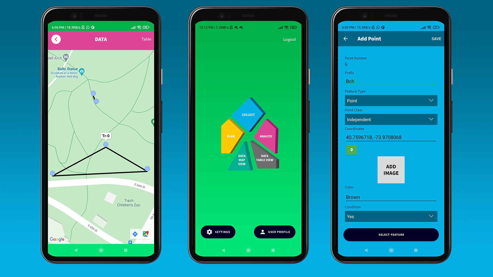
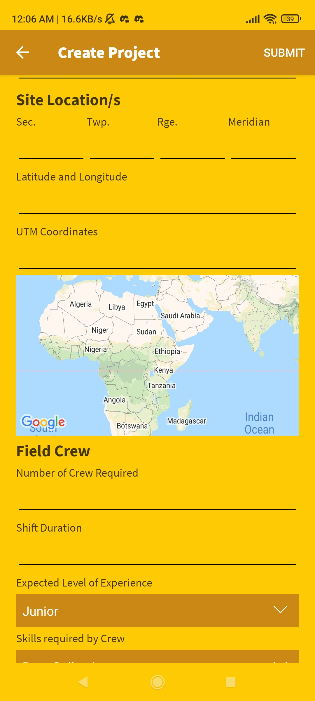
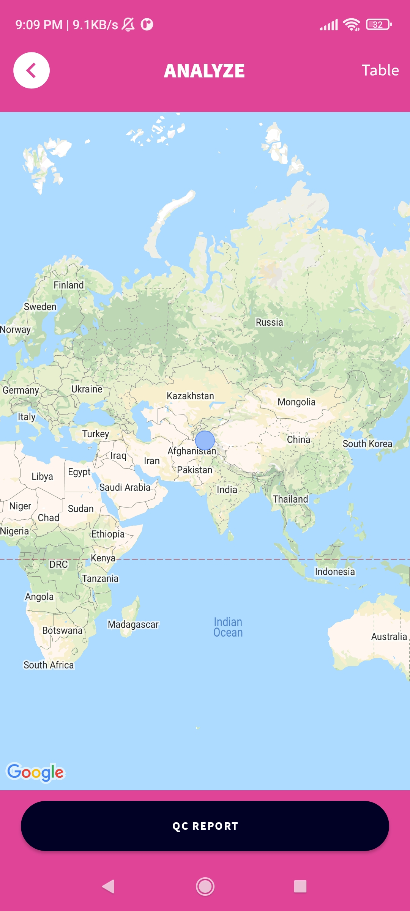
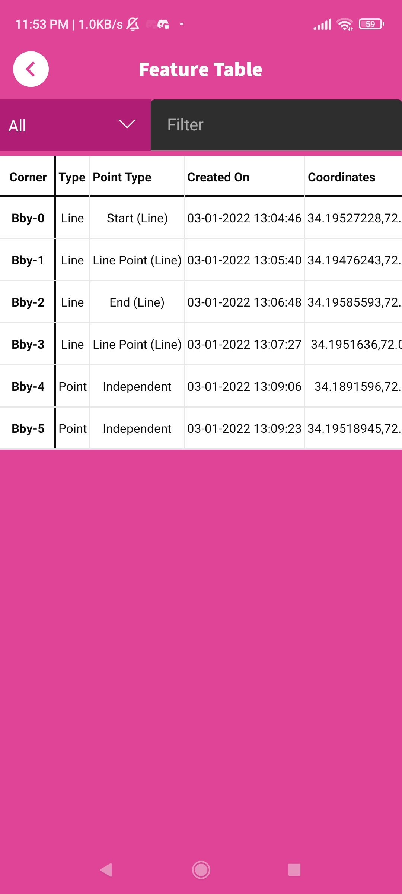
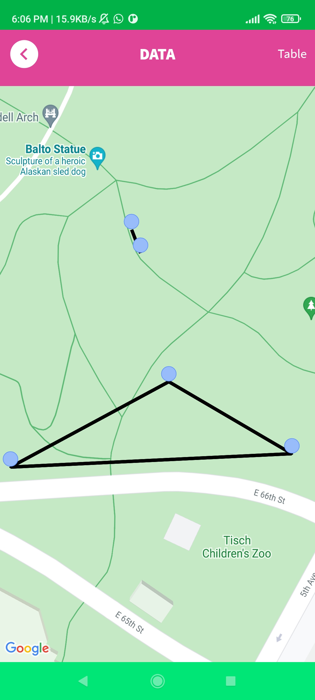
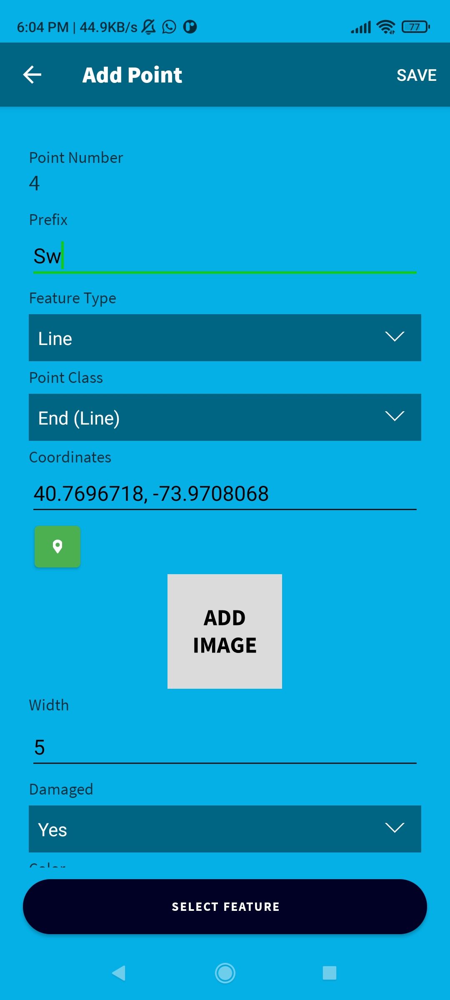

# Rebuild Together - A GIS survey tool for Android

Rebuild Together is a GIS mobile application that is used to survey land and various features.

### Features

- Create Projects
- Create Custom Features for various data points
- Collect location data such as feature id, coordinates, images, feature name etc.
- Analyze the collected data on the map, as well as, in table form.
- Quality check the collected data

### Screenshots

*This is a project that I did for a client. Contact for more information about the application*
